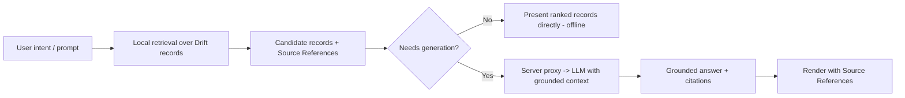

# AI Assistant Architecture — Tonary Scout & Briefs

The AI layer behind **Tonary Scout** (recommendations/matching) and **Tonary Briefs**
(fast explanations, comparisons, next steps). Parent:
[flutter-mobile-architecture.md](./flutter-mobile-architecture.md). Data source:
[content-knowledge-base.md](./content-knowledge-base.md) and
[data-layer.md](./data-layer.md).

## Product stance (from brand)

Tonary is **not an "AI chatbot" first**. Assistant language appears **only when it
helps the user's next action** — recommend a plugin, compare two patches, suggest the
next step. Answers are **grounded and evidence-backed**: every substantive claim cites
**Source References** from the local knowledge base. The AI helps users move faster
*without flattening the creative process* — it surfaces and organizes, it does not
decide for them.

## RAG over the local Vault (retrieval-first)

The knowledge lives on-device in Drift (Plugin / Preset / Workflow / Sound Design Note
/ Source Reference records). Scout and Briefs are **retrieval-augmented**: retrieve
relevant records locally, then either present them directly or pass them as grounded
context to a generation step.

### Retrieval (on-device, offline)

- **Recommendation:** start with **lexical/structured retrieval** — full-text search
  (Drift FTS5) + tag/capability/category filters over Vault records. This is fast,
  fully offline, deterministic, and needs no model. Much of Scout's value (match a
  plugin to a goal, find presets by tag) is pure retrieval + ranking.
- **Recommendation (phase 2):** add **on-device embeddings** for semantic recall
  (nearest-neighbor over record vectors precomputed at seed time). Enables "sounds
  like…" matching without network. **Open Question:** on-device embedding model choice
  and size budget — deferred.

### Generation (network, optional)

Only Scout/Briefs *composition* (natural-language explanation, comparison narrative,
"why/next" suggestion) needs an LLM. Retrieved records + their Source References are
passed as grounded context so the model summarizes **evidence it was given**, not its
own training. If offline, the app degrades gracefully to retrieval-only results (see
[offline-first-strategy.md](./offline-first-strategy.md)).

## On-device vs API tradeoffs

| Approach | Pros | Cons | Use for |
|----------|------|------|---------|
| On-device retrieval (FTS/filters) | Offline, instant, free, private, deterministic | No natural-language synthesis | Scout matching, Vault/Search — **default** |
| On-device embeddings | Offline semantic recall, private | Model size, battery, setup complexity | Phase-2 "sounds like" recall |
| Server-proxied LLM API | Best synthesis/comparison quality | Needs network, cost, latency | Briefs prose, Scout explanations |
| On-device LLM | Fully offline generation | Large binary, weak quality on phones today | Not recommended now |

## Provider & key handling

**Open Question:** the generation provider is not finally decided.

**Recommendation (default):** **Claude API** via a **thin service in
`core/services/`** (e.g. `ScoutService` / `AiClient`) behind an interface so the
provider is swappable. Critical rule:

> **Never embed API keys in the app.** All LLM calls route through a **server-side
> proxy/backend** that holds the key, enforces rate limits, and strips/logs. The
> Flutter app calls *your* endpoint, not the model vendor directly.

- The app-side client is a small interface (`AiClient.complete(groundedContext)`) with
  a fake for tests — no vendor SDK leaks into features.
- **Open Question:** the proxy/backend host is tied to the undecided backend provider
  (see [data-layer.md](./data-layer.md)). Until it exists, generation is stubbed and
  the app runs retrieval-only.

## Grounding & safety rules

1. **Cite or don't claim.** Briefs/Scout answers include the Source References for
   each claim; unsupported statements are not shown as fact.
2. **No fabrication.** The model may only synthesize from retrieved records; if
   retrieval returns nothing relevant, say so and offer the closest records — never
   invent plugin data.
3. **Retrieval-first.** Prefer showing records over generating prose; generate only
   when narrative genuinely helps the next action.
4. **Transparent degradation.** Offline or proxy-down → retrieval-only, clearly
   labeled, no silent quality drop.
5. **Privacy.** User prompts and saved items are personal; send to the proxy only what
   a request needs, and document retention in settings.

## Where it lives

- `core/services/ai_client.dart` — provider-agnostic interface + Claude-backed impl
  (calls the proxy).
- `features/scout/` — retrieval + ranking providers, Scout UI, result/session state
  (see [state-management.md](./state-management.md)).
- `features/briefs/` — Brief composition UI, citation rendering.
- Retrieval reads Drift via repositories — the AI layer never touches sources directly.
