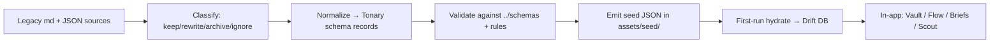

# Content Knowledge Base — Tonary

How migrated FL Studio knowledge becomes the app's on-device knowledge base powering
**Tonary Vault**, **Tonary Scout**, and **Tonary Briefs**. Parent:
[flutter-mobile-architecture.md](./flutter-mobile-architecture.md). Governed by
[../rules/content-migration-rules.md](../rules/content-migration-rules.md) and mapped
in [../outputs/migration-map.md](../outputs/migration-map.md).

## Source material (legacy DEEPER DIVES)

The legacy content lives as per-plugin folders (~190 exist; ~98 standardized). Each
standardized folder contains:

- `00-START-HERE.md`, `MASTER-INDEX.md`, `README.md`
- `01-Learning/{Concepts, Quick-Reference}` — conceptual + cheat-sheet prose
- `02-Data/{parameters, presets, rules}` — **JSON** (the highest-value structured data)
- `03-Workflows/{by-goal, by-instrument}` — task-oriented recipes
- `04-Reference/technical-docs` — deeper reference
- plus a legacy web "Plugin Page Setup" (HTML/CSS/JS) — **DISCARD** (legacy web).
- Legacy `manifest.json`: `id` (kebab-case), `name`, `category`, `tier` (Free/Premium),
  `type` (Generator/Effect), `description`, `tags[]`, `capabilities[]`, `version`,
  `color`.

**Migration principle (HARD):** legacy content is *strategic source material, not a
direct app blueprint*. Start with a migration MAP, not a bulk import. Every source is
classified keep / rewrite / archive / ignore. Never fabricate plugin data or invent
facts. Discard: legacy web HTML/CSS/JS, purple glassmorphism theme, Next.js code,
`.ico`/`desktop.ini` artifacts, batch/session-summary meta-files.

## Source → module mapping

| Legacy source | Normalized record | Powers |
|---------------|-------------------|--------|
| `manifest.json` + `README.md` | **Plugin Record** | Vault browse/detail, Scout matching |
| `02-Data/parameters` (JSON) | Plugin params on Plugin Record | Vault detail, Briefs compare |
| `02-Data/presets` (JSON) | **Preset Record** | Vault preset lists, Scout preset match |
| `02-Data/rules` (JSON) | **Sound Design Note** | Briefs "why/next", Scout guidance |
| `03-Workflows/by-goal`,`by-instrument` | **Workflow Recipe** | Tonary Flow, Scout setup paths |
| `01-Learning/Concepts`,`Quick-Reference` | **Sound Design Note** / Learning content | Briefs explanations |
| `04-Reference/technical-docs` | **Source Reference** + notes | Review evidence, Scout/Briefs citations |
| provenance of each fact | **Source Reference** | Grounding for AI answers |

## Content pipeline

Stage detail:

1. **Classify** — per [../rules/content-migration-rules.md](../rules/content-migration-rules.md),
   tag each source keep / rewrite / archive / ignore. Discard legacy web + meta noise.
2. **Normalize** — a build-time transform (outside the app, **Recommendation:** a Dart
   or Node script in tooling) maps source md/JSON → Tonary schema records. JSON `02-Data`
   maps most cleanly; prose is summarized into Sound Design Notes with source refs.
   Legacy `manifest.json` fields map straight onto Plugin Record fields.
3. **Validate** — every record is checked against [../schemas/](../schemas/): required
   fields present, `id` kebab-case, `tier`/`type` enum-valid, no orphan foreign keys,
   every claim linked to a Source Reference. Fail closed — no fabricated fills.
4. **Seed emit** — validated records are written to `assets/seed/*.json` (one file per
   record type: `plugins.json`, `presets.json`, `workflow_recipes.json`,
   `sound_design_notes.json`, `source_references.json`).
5. **Hydrate** — on first run the seed source bulk-loads JSON → Drift (see
   [data-layer.md](./data-layer.md)); guarded by a `seedVersion` marker so re-seeding
   only runs on dataset upgrades.
6. **Serve in-app** — repositories read Drift; features render. Fully offline.

## How each module consumes it

- **Tonary Vault** — the browse/recall home of Plugin, Preset, and chain records; the
  canonical, curated dataset users search and save.
- **Tonary Flow** — Workflow Recipes (by goal / by instrument) as step-through setups.
- **Tonary Briefs** — fast explanations and comparisons composed from Sound Design
  Notes + Plugin/Preset records, each answer citing Source References.
- **Tonary Scout** — retrieval over Vault records to recommend plugins/presets/chains
  (see [ai-assistant-architecture.md](./ai-assistant-architecture.md)).
- **Tonary Review** — surfaces the Source References behind a record so users can
  evaluate evidence.

## Quality rules

- **No fabrication.** A record exists only if it traces to a real migrated source.
  Missing data stays missing (nullable), never invented.
- **Provenance everywhere.** Facts used by Briefs/Scout carry Source Reference IDs so
  answers are evidence-backed.
- **Curated, not scraped.** Tonary is not a generic plugin wiki; the value is the
  standardized, evaluated, cross-linked dataset.
- **Recommendation:** version the seed dataset (`seedVersion`) and record the source
  commit/date it was generated from in [../outputs/migration-map.md](../outputs/migration-map.md).

## Open Questions

- **Open Question:** which of the ~190 folders (98 standardized) ship in the first
  seed — full set vs a curated launch subset. Tracked in the migration map.
- **Open Question:** cadence and mechanism for post-launch content updates (bundled
  app update vs future remote refresh — see the remote source in
  [data-layer.md](./data-layer.md)).
