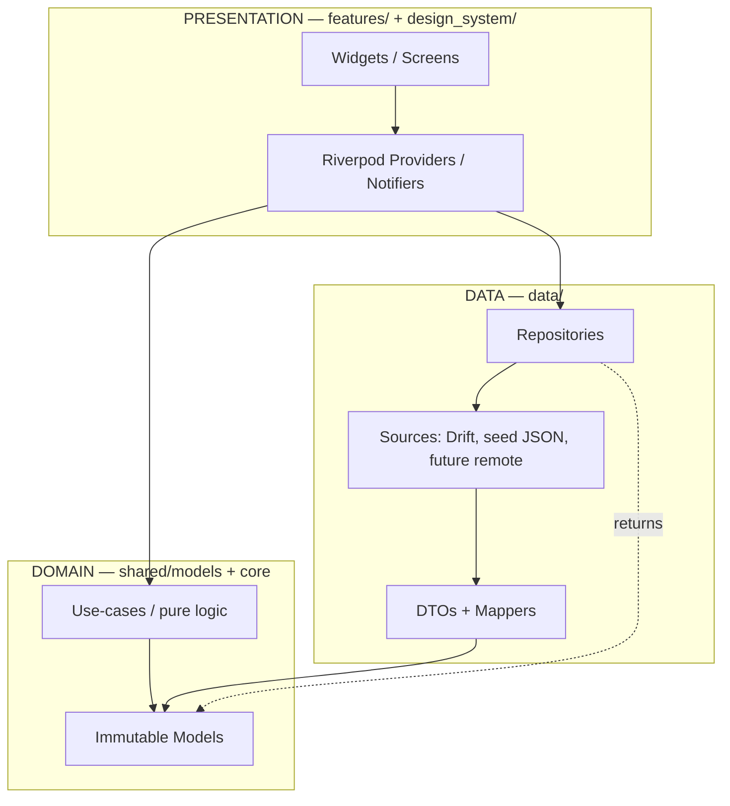

# Flutter Mobile Architecture — Tonary

The overall mobile-first architecture for **Tonary**, the dark-first sound-design
intelligence layer for FL Studio producers. This is the canonical entry point for
all architecture decisions; sibling files drill into each concern.

- Folder tree: [app-folder-structure.md](./app-folder-structure.md)
- Navigation: [navigation-architecture.md](./navigation-architecture.md)
- State: [state-management.md](./state-management.md)
- Data: [data-layer.md](./data-layer.md)
- Knowledge base: [content-knowledge-base.md](./content-knowledge-base.md)
- AI layer: [ai-assistant-architecture.md](./ai-assistant-architecture.md)
- Offline: [offline-first-strategy.md](./offline-first-strategy.md)
- Testing: [testing-strategy.md](./testing-strategy.md)

## Why Flutter, why mobile-first

**Recommendation: Flutter (iOS + Android from one codebase).** Tonary is a
recall-and-apply companion used *beside* a desktop DAW session — the producer
reaches for a phone/tablet to compare a plugin, recall a chain, or read a Brief.
That is an inherently mobile, glanceable, offline-tolerant use case. Flutter gives
a single Dart codebase, a fully custom dark-first design system (no fighting native
theme defaults), 60/120fps motion honoring the brand motion tokens, and mature
offline persistence (Drift/SQLite).

**Mobile-first is mandated and absolute.** No desktop-first layouts, no web
architecture carried over. Layouts are built for one-hand phone use first, then
allowed to breathe on tablet via responsive breakpoints — never the reverse.

## The pivot away from the legacy Master Hub

The legacy **FL Studio Master Hub** is Next.js 14 / React / Tailwind / Chart.js /
GSAP with a static export and a "purple glassmorphism / Deep Space Cyberpunk" theme.
Tonary is a **different product and a hard pivot**. We carry over **only its data
model ideas** (plugin/preset/workflow record shapes). We discard its web component
code, its theme, its routing, and its build system entirely. See
[../rules/content-migration-rules.md](../rules/content-migration-rules.md).

## Layered architecture

Pragmatic clean-ish layering — three logical layers, dependencies point inward.
Keep it lightweight; do not over-engineer with a use-case class per action unless a
feature earns it.

Layer responsibilities:

| Layer | Lives in | Owns | Never does |
|-------|----------|------|------------|
| Presentation | `features/`, `design_system/`, `shared/widgets/` | Rendering, user intent, provider wiring | Talk to Drift/HTTP directly; hold business rules |
| Domain | `shared/models/`, `core/` | Immutable models, pure logic, error types | Import Flutter widgets or data sources |
| Data | `data/` | Repositories, DTOs, mappers, sources | Import from `presentation`/`features` |

## Dependency rules (enforced in review)

1. **Features never import each other.** Cross-feature needs go through `shared/`
   or `domain`. `features/scout` must not import `features/vault`.
2. **Data never imports presentation.** No `import 'package:flutter/...'` under
   `data/` except where a source genuinely needs it (rare; prefer none).
3. **Domain imports nothing app-specific downward.** Models are Flutter-free and
   testable in plain Dart.
4. **Dependencies point inward** — presentation → domain ← data. Domain is the
   stable core.
5. **DTOs stay in data.** Domain models never leak JSON/DB annotations; a mapper
   converts DTO → domain at the repository boundary.

## State, navigation, storage (summary)

- **State — Recommendation: Riverpod.** Feature-scoped providers, async data via
  `AsyncNotifier`/`FutureProvider`, zero business logic in widgets.
  *Alternative: Bloc* (more ceremony, stronger for complex event streams). See
  [state-management.md](./state-management.md).
- **Navigation — Recommendation: go_router** with a `StatefulShellRoute` bottom-nav
  shell for per-tab state. See [navigation-architecture.md](./navigation-architecture.md).
- **Storage — Recommendation: Drift (SQLite)** as the local source of truth plus a
  **bundled seed JSON** dataset in `assets/`. *Alternative: Isar.* See
  [data-layer.md](./data-layer.md) and [offline-first-strategy.md](./offline-first-strategy.md).

## Offline-first posture

The app is fully usable with **zero connectivity** for all core browse/recall/compare
flows — the seed dataset ships in the binary and hydrates Drift on first run. Only
**Tonary Scout** AI *generation* requires network. Details in
[offline-first-strategy.md](./offline-first-strategy.md).

## Design system integration

Brand tokens (dark-first) live in `design_system/tokens/` and are exposed through
`ThemeData` plus `TonaryColors` / `TonaryTypography` theme extensions. Semantic Dart
names (`TonaryColors.bgApp`) — never the legacy `--citrus-console-*` CSS variable
names. Color law is enforced in review: violet = brand action, lavender = focus/system,
green = success, lavender = exploratory, rose = exceptional.

## Open Questions

- **Open Question:** Backend/sync provider is undecided (Supabase, Firebase, custom).
  All remote sources are deferred; the architecture treats remote as an additive
  future source behind existing repository interfaces.
- **Open Question:** Scout AI provider (default recommendation: Claude API via a
  server-proxied thin service — never embed keys in the app). See
  [ai-assistant-architecture.md](./ai-assistant-architecture.md).
