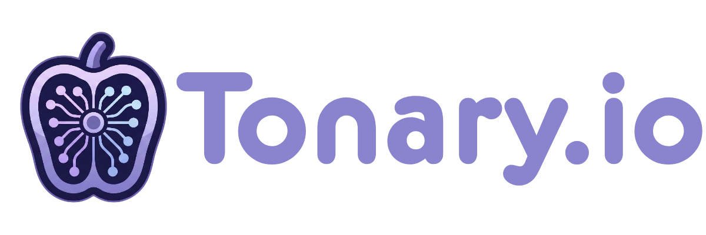
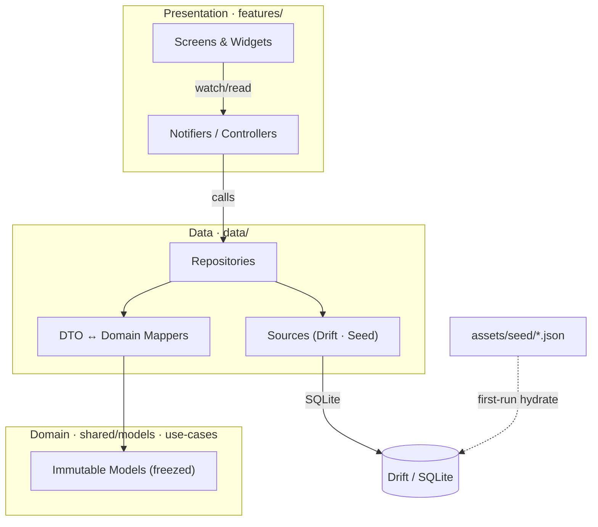
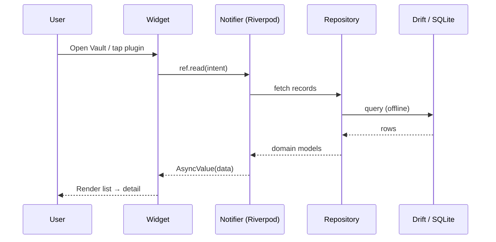
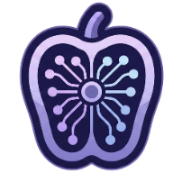

<div align="center">



<br />

### A dark-first sound-design intelligence layer for FL Studio producers

Organize, understand, compare, recall, and apply plugin knowledge — on mobile, offline-first.

[](https://flutter.dev)
[](https://dart.dev)
[](#)
[](https://riverpod.dev)
[](https://drift.simonbinder.eu)
[](#roadmap)

</div>

---

## Table of Contents

- [Overview](#overview)
- [Modules](#modules)
- [Features](#features)
- [Screenshots](#screenshots)
- [Tech Stack](#tech-stack)
- [Architecture](#architecture)
- [Data Flow](#data-flow)
- [Brand](#brand)
- [Getting Started](#getting-started)
- [Project Structure](#project-structure)
- [Testing](#testing)
- [Content & Data Policy](#content--data-policy)
- [Roadmap](#roadmap)
- [Conventions](#conventions)
- [License](#license)

## Overview

**Tonary** is a premium, mobile-first **Flutter** app (iOS + Android) that helps FL Studio producers, beatmakers, and sound designers **organize, understand, compare, recall, and apply** plugin, preset, and workflow knowledge — without flattening the creative process.

> *Tonary.io is a dark-first sound-design intelligence layer that helps FL Studio producers organize plugin knowledge, evaluate patches, compare choices, and move faster.*

It is **not** a plugin database, an AI chatbot, or a DAW. Every fact it surfaces traces back to a cited **Source Reference** — nothing is fabricated.

<table>
<tr>
<td><b>🌙 Dark-first</b><br/>Built for low-light studio sessions from the first pixel.</td>
<td><b>📴 Offline-first</b><br/>The local database is the source of truth — no network required.</td>
</tr>
<tr>
<td><b>🔍 Evidence-backed</b><br/>Every record cites a source; unknowns stay flagged, never guessed.</td>
<td><b>📱 Mobile-first</b><br/>Thumb-reachable, 360–430pt canvas, bottom navigation.</td>
</tr>
</table>

## Modules

| Module | Role | Status |
| :--- | :--- | :--- |
| 🧭 **Scout** | AI recommendations — plugin / preset / chain matching | 🟡 Rules-based (AI ranking deferred) |
| 🗄️ **Vault** | Curated plugin, preset, chain & parameter records | 🟢 Live |
| 🔎 **Review** | Source review + evidence-backed notes | ⚪ Deferred |
| 🌊 **Flow** | Workflow recipes, setup paths, sound-design playbooks | ⚪ Deferred |
| 📋 **Briefs** | Fast explanations, comparisons, next-step suggestions | 🟢 Live |

## Features

- **Vault** — browse curated plugin records (list → detail) with parameters, capabilities, and sources.
- **Search** — fast offline plugin search, reachable from the Vault app bar.
- **Briefs** — side-by-side comparison of two plugins with evidence-backed notes and next-step recipes.
- **Scout** — transparent, rule-based recommendations over your Vault, showing *why* each match surfaced.
- **Saved** — bookmark plugins from detail view; persisted locally and surfaced in a dedicated Saved screen.
- **Home** — a branded hub routing into every module, with live offline dataset stats.
- **Settings** — grounded appearance, dataset, accessibility, and about sections (incl. non-affiliation disclaimer).
- **Onboarding** — first-run intro carousel gated by a durable `onboardingComplete` flag.

Everything renders **offline** — the local database is the source of truth; the network is only for optional AI generation and refresh.

## Screenshots

> 📸 Device captures land here as the MVP screens stabilize. Drop PNGs into `assets/branding/screenshots/` and swap them into the grid below.

| Home | Vault | Briefs | Scout |
| :---: | :---: | :---: | :---: |
| _coming soon_ | _coming soon_ | _coming soon_ | _coming soon_ |

## Tech Stack

| Concern | Choice |
| :--- | :--- |
| Framework | Flutter (iOS + Android, mobile-first) |
| State | [Riverpod](https://riverpod.dev) (`flutter_riverpod` + codegen) |
| Navigation | [go_router](https://pub.dev/packages/go_router) |
| Local data | [Drift](https://drift.simonbinder.eu) / SQLite, seeded from bundled JSON |
| Models | [freezed](https://pub.dev/packages/freezed) + `json_serializable` |
| Codegen | `build_runner` |
| Formatting | `intl` |

## Architecture

Layered and pragmatic — dependencies point inward, features never import each other, and data never imports presentation.



**Offline-first:** the bundled seed JSON (`assets/seed/`) is hydrated into Drift on first run and becomes the app's source of truth. The network is reserved for optional Scout AI generation and refresh.

## Data Flow



## Brand

Dark-first, with a fixed color law — **amber is a brand-action color only**, never decoration.

| Token | Hex | Role |
| :--- | :--- | :--- |
| `bg-app` | `#07090a` | App background |
| `surface-card` | `#151a1f` | Card surface |
| `text-primary` | `#f8faf2` | Body text |
| `amber` | `#ffb13b` | Brand action |
| `cyan` | `#38bdf8` | Focus / system |
| `green` | `#33d17a` | Affirmative |
| `violet` | `#a78bfa` | Exploratory / creative |
| `red` | `#f87171` | Exceptional / danger |

Typefaces: **Inter** (UI), **Space Grotesk** (display), **IBM Plex Mono** (IDs/params) — bundled offline (OFL).

## Getting Started

### Prerequisites

- [Flutter](https://docs.flutter.dev/get-started/install) SDK (Dart `^3.12`)
- An iOS Simulator / Android emulator or a physical device

### Install & run

```bash
# install dependencies
flutter pub get

# generate code (drift / freezed / json / riverpod)
dart run build_runner build --delete-conflicting-outputs

# launch on a connected device or simulator
flutter run
```

### Working with codegen

Keep the generator running in watch mode while developing models, DTOs, or providers:

```bash
dart run build_runner watch --delete-conflicting-outputs
```

<details>
<summary><b>Troubleshooting</b></summary>

- **Stale generated files / conflicts** — rerun with `--delete-conflicting-outputs`.
- **`flutter analyze` errors after editing models** — regenerate before analyzing; the `*.g.dart` / `*.freezed.dart` files must be current.
- **No devices found** — run `flutter devices`; start an emulator/simulator or plug in a device.
- **Seed not appearing** — the seed hydrates on *first* run; reinstall the app (or clear app data) to re-trigger hydration.

</details>

## Project Structure

```
lib/
├── app/            app shell, router, theme, bootstrap
├── core/           errors, utils, services
├── shared/         shared widgets + domain models
├── features/       home · vault · scout · briefs · search · saved · settings · onboarding
├── data/           repositories · sources (drift, seed) · dto · mappers
└── design_system/  tokens · colors · typography · spacing · components

assets/
└── seed/           bundled offline dataset (plugins, presets, notes, recipes, sources)
```

Each `features/<name>/` contains `presentation/` (screens, widgets) and `application/` (notifiers/controllers).

## Testing

```bash
flutter analyze   # must be clean — lints are treated as errors
flutter test      # unit + widget tests
```

- **Unit-test** domain logic, services, mappers, and validators.
- **Widget-test** feature screens across states: loading, empty, error, populated.
- **Golden-test** design-system components.
- New logic ships with tests — a change isn't *done* until the build is clean and behavior is verified.

## Content & Data Policy

Tonary ships **curated, cited data — never reproduced IP**:

- Every factual record carries a **Source Reference**; unsourced records are invalid.
- Manual text is **rephrased, never reproduced**; expression is cited or linked out.
- **No factory preset files** or exact patch dumps — preset knowledge ships as original recipes.
- **No fabrication** — unknown values stay absent and flagged, never guessed.
- "FL Studio" / "Image-Line" appear as **compatibility context only**; a non-affiliation disclaimer ships in Settings ▸ About.

The reviewed pilot dataset ships **FLEX**, **Sytrus**, and **Fruity Parametric EQ 2**.

## Roadmap

- ✅ Phase 0 foundation — app shell, design system, Drift data layer, seed pipeline
- ✅ MVP modules — Vault, Search, Briefs, Scout (rules), Home, Saved, Settings, Onboarding
- ⏳ Scout AI ranking (grounded retrieval with cited answers)
- ⏳ Review & Flow modules
- ⏳ Expanded, source-verified plugin dataset

## Conventions

Detailed operating rules live under [`.claude/`](.claude/) and [`CLAUDE.md`](CLAUDE.md):

- Dart files `snake_case.dart` · classes `PascalCase` · record ids `kebab-case` · JSON keys `camelCase`
- No hardcoded hex or magic spacing in widgets — pull from `design_system/` tokens
- Layers stay honest: features never import each other; data never imports presentation
- New logic ships with tests; a change isn't done until `flutter analyze` is clean and behavior is verified

## License

Private project — `publish_to: none`. Not licensed for redistribution.

---

<div align="center">



**Tonary** · `TONARY.wav` is hero/campaign styling only — never the app, package, or store name.

</div>
